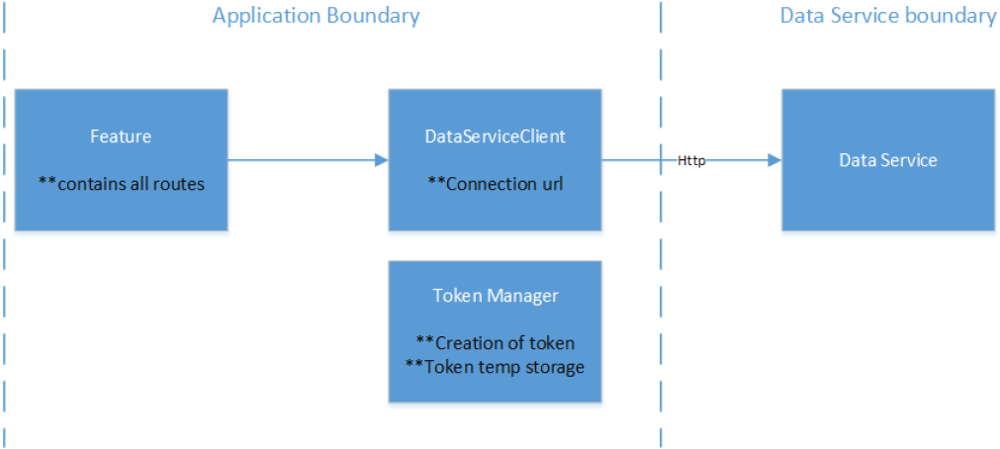

# Application example

- [Application example](#application-example)
  - [Description](#description)
  - [Build and execute](#build-and-execute)
  - [Requirement](#requirement)
  - [Logical view](#logical-view)
  - [Creating users and token management](#creating-users-and-token-management)
  - [Assets, tags and time series information](#assets-tags-and-time-series-information)
  
## Description

This application example is intended to show you how to grant access to the "Data Service" to your own apps.

You will create a user, request a token and get the assets, tags and time series data from the app.

You must carry out the following steps beforehand:

## Build and execute

To build the project, follow these steps:

1. Download the required Node modules.
2. To do this, open the command line in the folder with the "package.json" file and enter the following commands:

- `npm install`
- `npm run build`
- `npm run start`

The app is started in the browser with the local host "https://localhost:5200".

## Requirement

The Data Service app should be executed and the Configuration UI should be running; otherwise, an incorrect connection is provided when accessing the routes below.

## Logical view

The logical representation is divided as follows:

- Feature: The routes are provided here and most of the integration for the token and communication with the client is done in this class.
- Token manager: With each call, the token is retrieved from the data service. However, it is advisable to store temporarily until the time it expires (30 minutes). The request to re-save from the token should ideally occur after each expiration.
- Data Service client: This class helps to configure the Data Service URL and establish the connection. The authorization headers for the http request are also managed here.

## Creating users and token management

An app can require a user to access the data service. This user provides a token that can be used to make calls to the Data Service. The lifetime of the token is 30 minutes if the user is available during this lifetime. For user creation and token management please use the feature (/User/create) and the token manager class (getAuthorizationToken()).

## Assets, tags and time series information

The same token mentioned above can be used to perform any operation in the Data Service. The tokens that do not expire are retrieved and added to the request header to retrieve a list of all or each of the required assets and tags. To call up time series information, the "getTimeSeries" method is provided in the feature.
