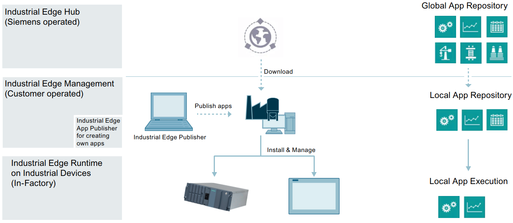
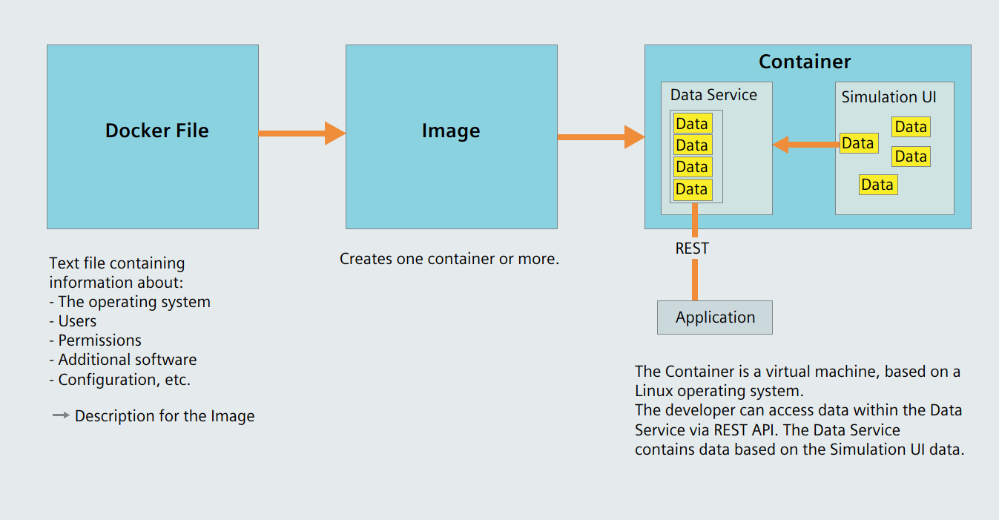

# Introduction

- [Introduction](#introduction)
  - [Security information](#security-information)
  - [Note on EU General Data Protection Regulation](#note-on-eu-general-data-protection-regulation)
    - [Data protection](#data-protection)
  - [Security Information for Industrial Edge Apps](#security-information-for-industrial-edge-apps)
  - [Overview of Industrial Edge](#overview-of-industrial-edge)
  - [Function overview](#function-overview)
    - [Description](#description)
    - [Requirement](#requirement)
    - [Docker](#docker)
      - [Explanation of terms](#explanation-of-terms)
    - [Data Service Development Kit Bundle](#data-service-development-kit-bundle)
  - [Application example - Legal information](#application-example---legal-information)
    - [Use of application examples](#use-of-application-examples)
    - [Disclaimer of liability](#disclaimer-of-liability)
    - [Other information](#other-information)
    - [Application example](#application-example)
  
## Security information

Siemens provides products and solutions with industrial security functions that support the secure operation of plants, systems, machines and networks.
In order to protect plants, systems, machines and networks against cyber threats, it is necessary to implement - and continuously maintain - a holistic, state-of-the-art industrial security concept. Siemens’ products and solutions constitute one element of such a concept.

Customers are responsible for preventing unauthorized access to their plants, systems, machines and networks. Such systems, machines and components should only be connected to an enterprise network or the internet if and to the extent such a connection is necessary and only when appropriate security measures (e.g. firewalls and/or network segmentation) are in place.

For additional information on industrial security measures that may be implemented, please visit:

[https://www.siemens.com/industrialsecurity](https://new.siemens.com/global/en/company/topic-areas/future-of-manufacturing/industrial-security.html)

Siemens’ products and solutions undergo continuous development to make them more secure. Siemens strongly recommends that product updates are applied as soon as they are available
and that the latest product versions are used. Use of product versions that are no longer supported, and failure to apply latest updates may increase customer’s exposure to cyber threats.

To stay informed about product updates, subscribe to the Siemens Industrial Security RSS Feed under:

[https://www.siemens.com/industrialsecurity](https://new.siemens.com/global/en/company/topic-areas/future-of-manufacturing/industrial-security.html)

## Note on EU General Data Protection Regulation

### Data protection

Siemens observes the principles of data protection, in particular the principle of data minimization (privacy by design). For the Data Service Development Kit for Industrial Edge product, this means: the product processes/stores the following personal data: The token from Industrial Edge Management to verify authentication.

No private or intimate data is processed or stored.  

The above data are required for the login, the billing function and for the internal user administration (administrator can see the role and the status of other users). The storage of data is appropriate and limited to what is necessary, as it is essential to identify the authorized operators. The data needs to be maintained manually by you and if necessary, these can also be deleted. If you need support, please contact customer support.

The above data will not be stored anonymously or pseudonymized, because the purpose (identification of the operating personnel) cannot be achieved otherwise.

The above data is protected against loss of integrity and confidentiality by state-of-the-art security measures.

## Security Information for Industrial Edge Apps

Security information (assumptions/constraints) for Industrial Edge Apps is as follows:

- Only authorized internal operators will have access to Industrial Edge Device within a secure network using VPN connection.
- Perimeter firewall configuration responsibility lies with the end customer.
- The security guidelines for usage of USB Flash Drives in the shop floor area are applied accordingly.
- Creating users with appropriate access rights upon commissioning is the responsibility of the operator.
- The customer is responsible for configuring the application on the basis of the system requirements and technical capabilities of the documented App according to the Installation / User Manual such that the automation system performance is not impacted.
- The system is installed in an environment ensuring that physical access is limited to authorized maintenance personnel only. Managing unauthorized attachment of removable devices is the responsibility of the operator.
- The platform including hardware, firmware and operating system is securely configured and maintained by the operator.
- The operator is capable of protecting the environment from malware infection.
- Centralized IT security components (Active Directory, Centralized IT Logging Server) are provided and well secured by the operator and are trustworthy.
- The operator personnel accessing the system is well trained in the usage of the system and general information security aspects like password handling, removable media, etc.
- The operator is responsible for the CIA (Confidentiality, Integrity and Availability) of data stored outside the Industrial Edge Device.
- The operator is responsible for configuring the CPUs with appropriate read/write access levels (legitimization), and for configuring the Industrial Edge Apps using appropriate passwords for data collection from CPUs.
- The customer takes care about the time synchronization of Industrial Edge Management and Industrial Edge Device.

## Overview of Industrial Edge

Siemens Industrial Edge is the next generation of digital automation. With Industrial Edge, you use intelligence and scalability of the cloud directly in your manufacturing - in a simple, high-performance manner and without your data leaving the manufacturing process. Industrial Edge combines local and high-performance data processing directly in automation with the advantages of the cloud: app-based data analysis, data processing and Infrastructure-as-a-Service concepts with central update functionality. In this way, you can quickly integrate apps into manufacturing and manage them with a high degree of automation.

Industrial Edge gives you the opportunity to continuously make changes to your automation components and plants, analyze large volumes of data in automation to realize innovative functions, such as preventive maintenance, and to obtain maximum flexibility and thus productivity over the entire machine life cycle.

With the Industrial Edge Hub, an App Store is available to you where you can find all Siemens apps and 3rd-party apps. From here, you can manage all licenses for your apps and devices centrally and install updates for security issues, device firmware, apps and Industrial Edge Management.

You can monitor and manage distributed Edge devices centrally in Industrial Edge Management. In this way, for example, new apps and software functions can be installed on all connected Edge devices company-wide. Central software management thus minimizes the workload for performing maintenance and updates on individual devices.

On the individual Edge devices, you can start and run apps and keep statistics on an Edge device, for example.

With the Industrial Edge Publisher, you can develop your own Edge apps and make them available to other users in Industrial Edge Management.

Another component of the Industrial Edge ecosystem is Industrial Edge Runtime, which is installed on Edge Devices (IED) or Unified Comfort Panels (UCP) and on which the system, including all applications, ultimately runs.

## Function overview

### Description

Using the Data Service Development Kit app you can develop your own apps based on the Data Service and integrate them into the Siemens Industrial Edge Management System.

### Requirement

- By default, the data is kept for a maximum of one week.
- Max 20 GB data memory

### Docker

Docker simplifies the deployment of apps because defined programs and environments can be transferred to another system with minimal effort.

#### Explanation of terms

- **Docker file:**
  A text file that describes an image with various commands. These are processed during execution and a single layer is created for each command.
- **Image:**
  A memory dump of a container. The image itself consists of several layers that are read-only and thus cannot be modified. Several containers can always be started from one image.
- **Container:**
  The active instance of an image is referred to as container. This means that the container is currently running and is busy. The container is automatically terminated as soon as the container is not running a program or is finished with its job. As a rule, one application runs per container.
- **Repository:**
  A repository is a set of images of the same name with different tags, mostly versions.

### Data Service Development Kit Bundle

You can download the Data Service Development Kit Bundle to your computer from the Siemens Industry Online Support. The bundle includes the following components:

- Docker file: docker-compose.yml
- User documentation
- [OpenAPI specification](../docs/OpenAPI_specification.md)
- [Application example](../docs/Application_example.md)

The image is loaded from the Docker Hub:

- Docker image
  - Data simulator
  - MQTT Broker
  - Data Service (with external interface (REST API) for non-Siemens applications)

## Application example - Legal information

### Use of application examples

Application examples illustrate the solution of automation tasks through an interaction of several components in the form of text, graphics and/or software modules. The application examples are a free service by Siemens AG and/or a subsidiary of Siemens AG ("Siemens"). They are non-binding and make no claim to completeness or functionality regarding configuration and equipment. The application examples merely offer help with typical tasks; they do not constitute customer-specific solutions. You yourself are responsible for the proper and safe operation of the products in accordance with applicable regulations and must also check the function of the respective application example and customize it for your system.

Siemens grants you the non-exclusive, non-sublicensable and non-transferable right to have the application examples used by technically trained personnel. Any change to the application examples is your responsibility. Sharing the application examples with third parties or copying the application examples or excerpts thereof is permitted only in combination with your own products. The application examples are not required to undergo the customary tests and quality inspections of a chargeable product; they may have functional and performance defects as well as errors. It is your responsibility to use them in such a manner that any malfunctions that may occur do not result in property damage or injury to persons.

### Disclaimer of liability

Siemens shall not assume any liability, for any legal reason whatsoever, including, without limitation, liability for the usability, availability, completeness and freedom from defects of the application examples as well as for related information, configuration and performance data and any damage caused thereby. This shall not apply in cases of mandatory liability, for example under the German Product Liability Act, or in cases of intent, gross negligence, or culpable loss of life, bodily injury or damage to health, non-compliance with a guarantee, fraudulent non-disclosure of a defect, or culpable breach of material contractual obligations. Claims for damages arising from a breach of material contractual obligations shall however be limited to the foreseeable damage typical of the type of agreement, unless liability arises from intent or gross negligence or is based on loss of life, bodily injury or damage to health. The foregoing provisions do not imply any change in the burden of proof to your detriment. You shall indemnify Siemens against existing or future claims of third parties in this connection except where Siemens is mandatorily liable.

By using the application examples you acknowledge that Siemens cannot be held liable for any damage beyond the liability provisions described.

### Other information

Siemens reserves the right to make changes to the application examples at any time without notice. In case of discrepancies between the suggestions in the application examples and other Siemens publications such as catalogs, the content of the other documentation shall have precedence.

The Siemens terms of use  [Siemens Industry Online Support](https://support.industry.siemens.com/cs/ww/en/) shall also apply.

### Application example

For additional information on the use of the application example, please visit: [Application example](../docs/Application_example.md)
