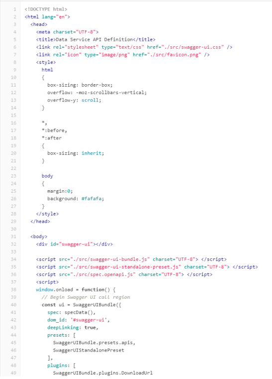
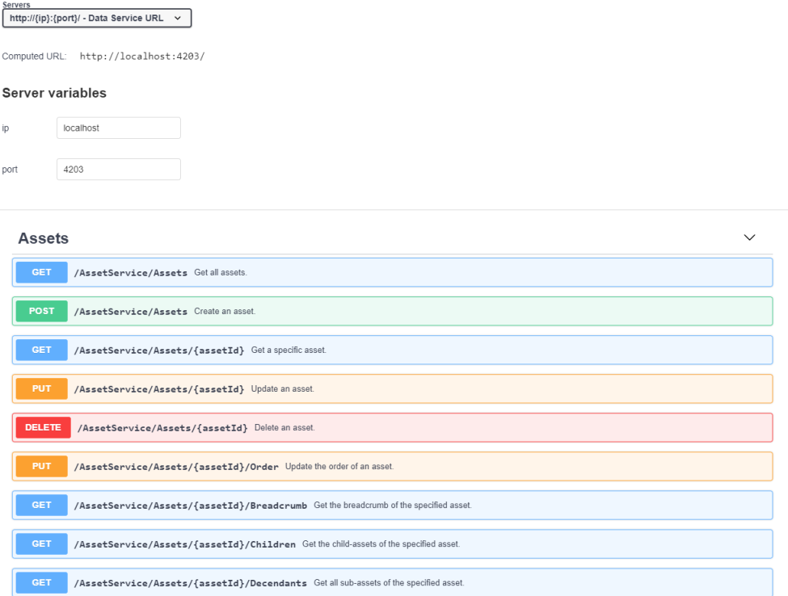

# OpenAPI specification

- [OpenAPI specification](#openapi-specification)
  - [Description](#description)
  - [Procedure](#procedure)
  
## Description

The OpenAPI Specification is a standard for describing REST-compliant application programming interfaces (API).

You will find the routes for the Data Service in the following file: [data-service-api-specification.html](../docs/openapi-documentation/data-service-api-specification.html)

View in browser:

## Procedure

To set up a connection to the OpenAPI of the Data Service, follow these steps:

1. Get a token that will not expire using the "getAuthorizationToken()" method.
2. You can then retrieve information, for example, by calling the "getTimeSeries" method.
3. Additional routes can be found in the OpenAPI.
