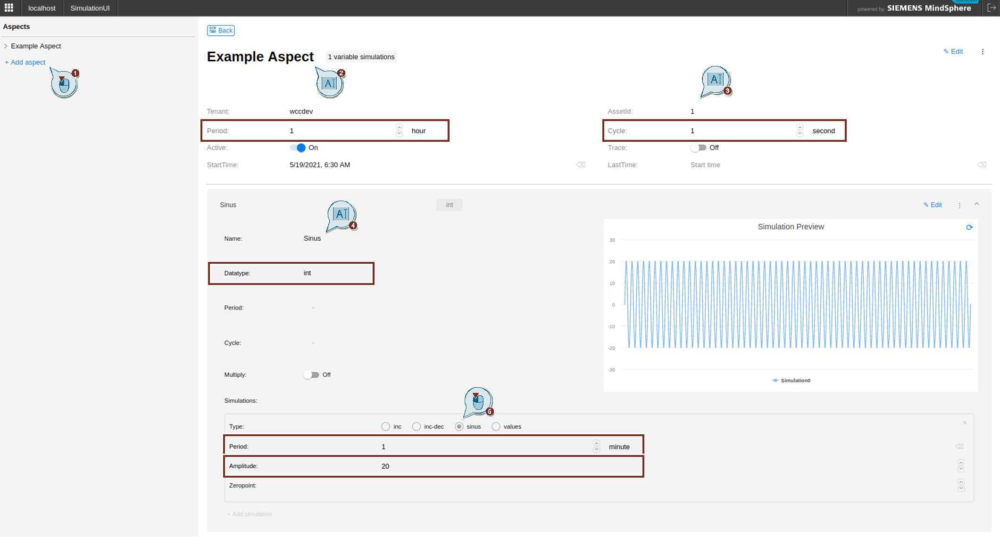
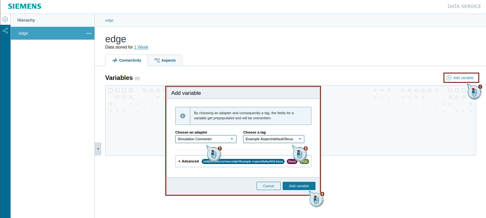
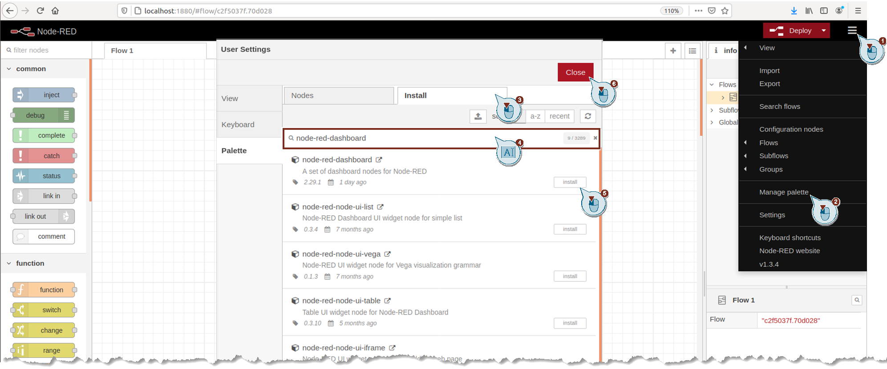
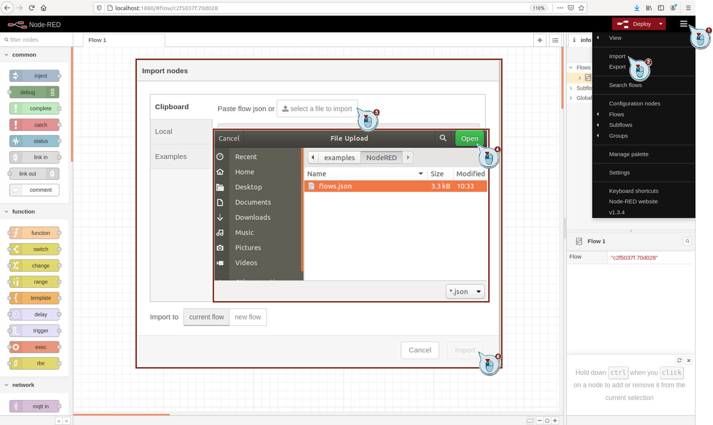
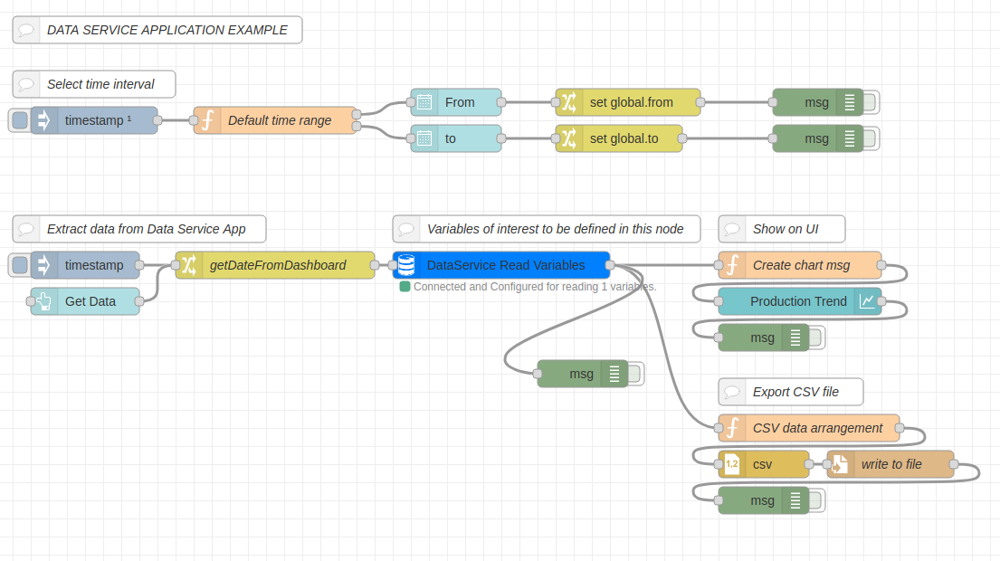
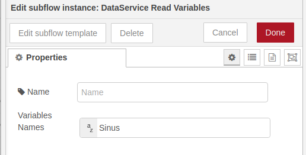
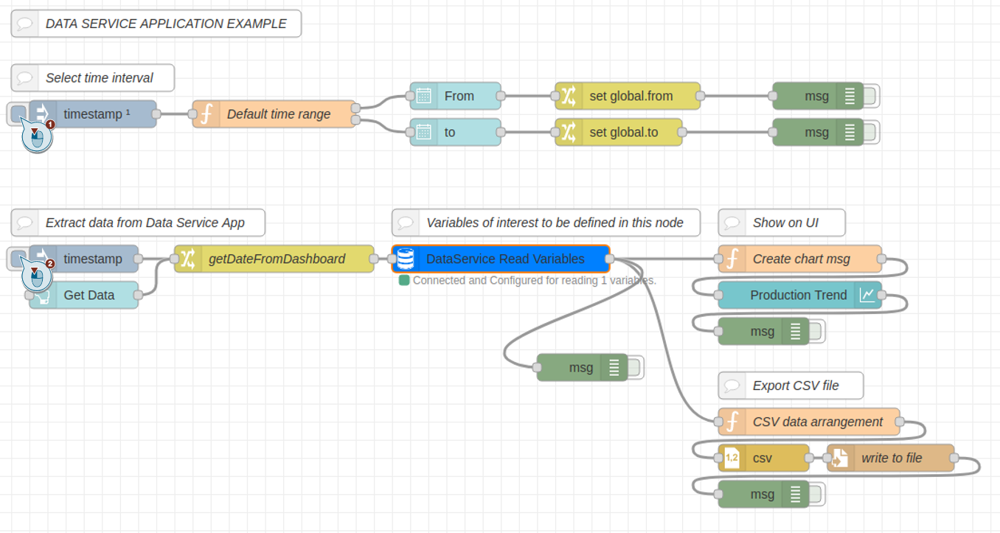

# Visualization of an example sinus in NodeRED

- [Visualization of an example sinus in NodeRED](#visualization-of-an-example-sinus-in-nodered)
  - [Description](#description)
  - [Start Docker Container](#start-docker-container)
  - [Create Tag in Simulation UI](#create-tag-in-simulation-ui)
  - [Transfer Tag to Data Service](#transfer-tag-to-data-service)
  - [Use provided application example to access Data via Node-RED and save data in .csv file](#use-provided-application-example-to-access-data-via-node-red-and-save-data-in-csv-file)
  
## Description

This example is intended to show you how to use this application on a example sinus variable.

You will create a tag in the Simulation UI, connect the tag with the data service, display the tag via browser and finally visualize the tag via Node-RED.

If you are interested in how the application example works, [here](./Implementation.md) you can find more details.

To follow this application example, you must carry out the following steps:

## Start Docker Container

To start the Docker container, follow these steps:

 > **_NOTE:_**  Linux device is used for this application example

1. Clone the [data service development kit](https://github.com/industrial-edge/data-service-development-kit) repository. 
2. Replace the docker-compose.yml with the [docker-compose.yml](../docker-compose.yml) of this repository containing Node-Red service.
3. Start the containers by executing: `docker-compose up`

## Create Tag in Simulation UI

To create a tag, follow these steps:

1. Open a browser.
2. Access the Simulation UI
   To start the simulation UI for the Data Service, enter the following address: `http://localhost:4519`
3. Add a Aspect with following configuration and save it
    - Name: Example Aspect
    - AssetId: 1
    - Period: 1 hour
    - Cycle: 1 second
4. Add a Variable with following configuration and save it
   - Name: Sinus
   - Datatype: int
   - Simulation:
     - Type: sinus
     - Period: 1 minute
     - Amplitude: 20



## Transfer Tag to Data Service

To connect the tag to the Data Service, follow these steps:

1. Open a browser.
2. To start the Data Service, enter the following address: `http://localhost:4203`
3. Add a Variable in tab "Connectivity"
   - Adapter: Simulation Connector
   - Tag: Example Aspect/default/Sinus




## Use provided application example to access Data via Node-RED and save data in .csv file

1. Create a folder in the same path where your docker-compose file is located and run the following command to make sure you have the right permission.
   ```bash
   mkdir export
   sudo chown -R 1000:1000 ./export
   ```
2. Open a browser.
3. Access Node-RED
   To start Node-RED, enter the following address: `http://localhost:1880`
4. Install the node-red-dashboard
   To install the node-red-dashboard, open "Manage palette" in the menu. In the tab "Install" search for "node-red-dashboard" and install it
    
5. Import the [Flow](../src/flows.json)
   To import the flow, open "Import" in the menu. Select the file, that should be imported, and click on "Import"
   
   The Flow contains following nodes:

   
6. Deploy the flow and access the dashboard by accessing `http://localhost:1880/ui`
7. Adjust the `From` and `To` variables based on your needs or leave it as it is for current date. 
8. Go back to your flow and double click on the `Data Service Read Variables` sub-flow. Make sure the "Variable names" match your variable inside of the Data Service. 
   
 > **_NOTE:_**  If you multiple variables, you can write them all in the "Variable names" setting sparated by commas without spaces.

9. Activate the inject buttons as described in the picture below.

   
10. Go back to the dashboard. You shoul be able to see your data visualized.

   
11. The `.csv` file is stored inside `./export` folder.