# Visualization of an example sinus in NodeRED

- [Visualization of an example sinus in NodeRED](#visualization-of-an-example-sinus-in-nodered)
  - [Description](#description)
  - [Start Docker Container](#start-docker-container)
  - [Create Tag in Simulation UI](#create-tag-in-simulation-ui)
  - [Transfer Tag to Data Service](#transfer-tag-to-data-service)
  - [Use provided application example to access Data via Node-RED and save data in .csv file](#use-provided-application-example-to-access-data-via-node-red-and-save-data-in-csv-file)
  
## Description

This example is intended to show you how to use this application on a example sinus variable.

You will create a tag in the Simulation UI, connect the tag with the data service, display the tag via browser and finally visualize the tag via Node-RED.

If you are interested in how the application example works, [here](./Implementation.md) you can find more details.

To follow this application example, you must carry out the following steps:

## Start Docker Container

To start the Docker container, follow these steps:

 > **_NOTE:_**  Linux device is used for this application example

1. Go to your device.
2. Open the console in the directory in which the application is to be stored
3. Clone the application example using the following command and then change the working directory:

   ```bash
   git clone <link of the git-repository>
   
   cd ./data-service-development-kit-getting-started-main
   ```
   The following components are contained in it:
   - docs: Here you will find the user documentation of the [iih-essentials-development-kit](../docs/development-kit) and the [dockerhub](../docs/dockerhub), the [routes (OpenAPI)](../docs/iih-essentials) for the Data Service and the [graphics](../docs/graphics) from the documentation
   - a general explanation in the [README.md](../README.md)
   - [docker-compose.yml](../docker-compose.yml): This file specifies which of the services run together, address,communication, etc.
   - [NodeRed-Flows](../src/flows.json)
   - [export](../export)-folder. This is where the data that was exported as a csv-file using NodeRed are stored
4. Start the containers by executing: 
```bash
   docker-compose up
   ```
   All service images are downloaded from Docker Hub and launched as defined in the "docker-compose.yml" file. 

## Create new Tag in Simulation UI

To create a tag, follow these steps:

1. Open a browser.
2. To access the Simulation UI, enter the following address: `http://localhost:4519`

3. Add a simulation group with following configuration and create it
   - Period: 1 minute
   - Cycle: 1 second

  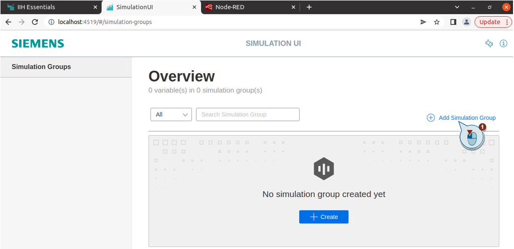

  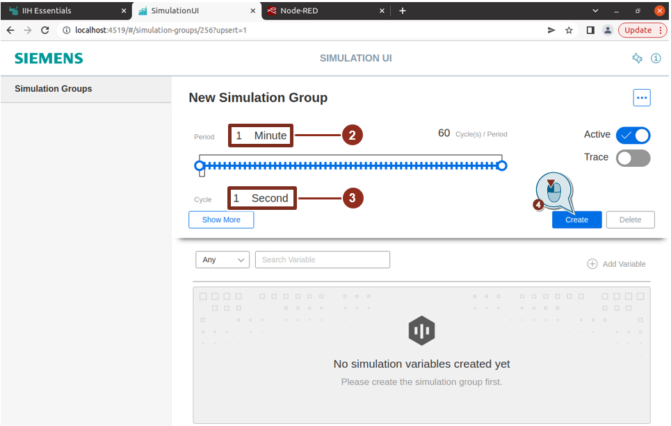


4. Add a new simulation variable to the created group
   - set the name to "Sinus"
   - type should be "Int"
   - add a simulation with following configuration
     - choose "sinus"
     - Period: 1 minute
     - Amplitude: 20
     - Zeropoint: 0
     - click on "Save"
   - click on "Create"

  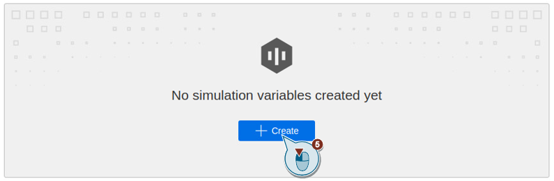

  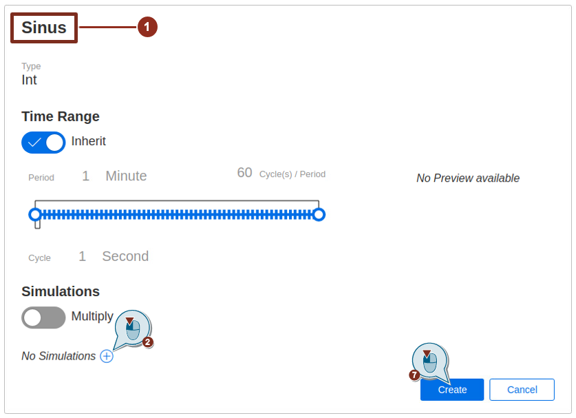

  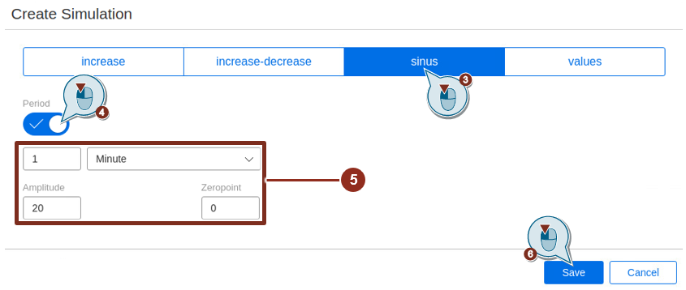

## Transfer Tag to IIH Essentials

To connect the tag to the IIH Essentials, follow these steps:

1. Open a browser.
2. To access the IIH Essentials UI, enter the following address: `http://localhost:4203`
3. Go to connectors and configure the connector to get the data from the simulation

  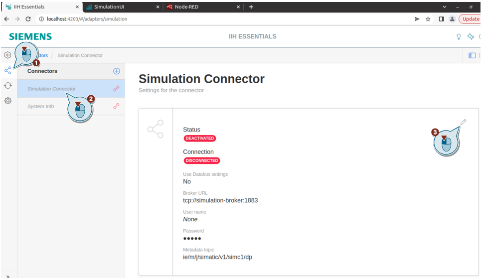

  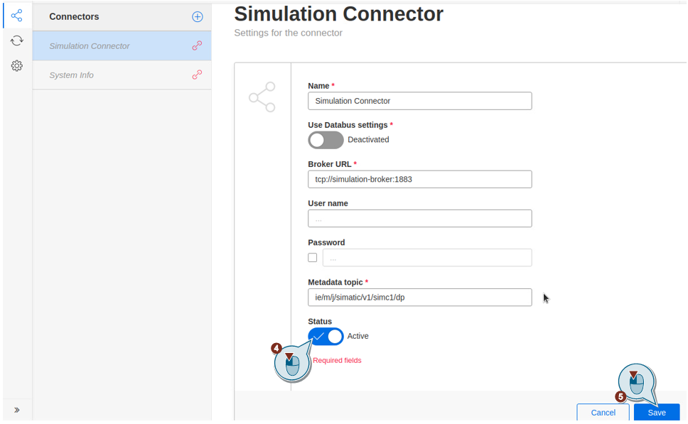

If configured correctly, it should look like this:

  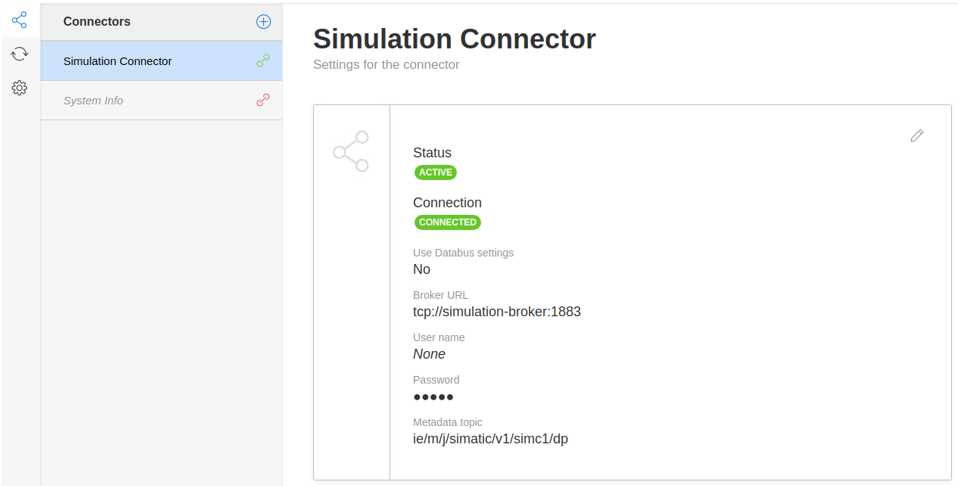

4. Create a new asset with following configuration and add it
    - Name: Example Asset

  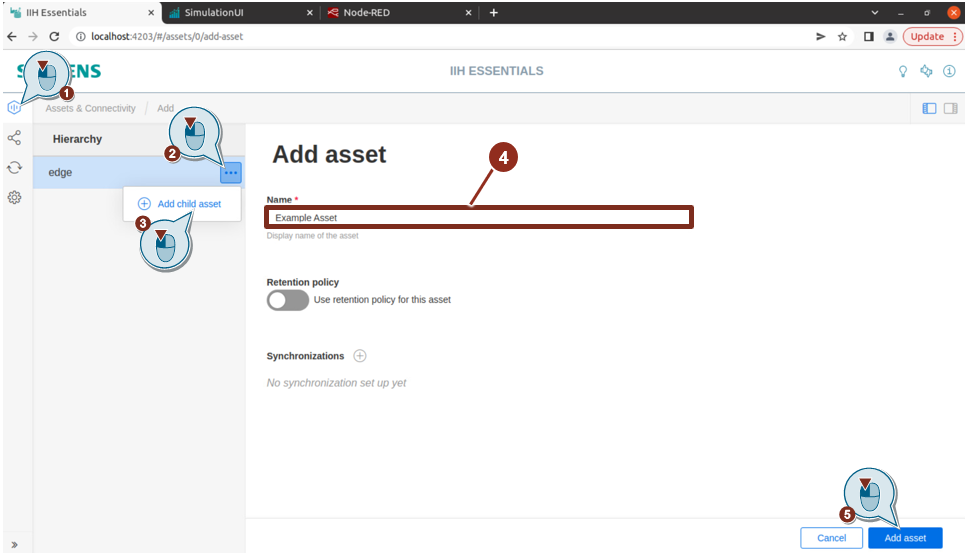

5. Create a Variable with following configuration and add it
   - Connector: Simulation Connector
   - Choose the created Tag "New Simulation Group/Sinus"

  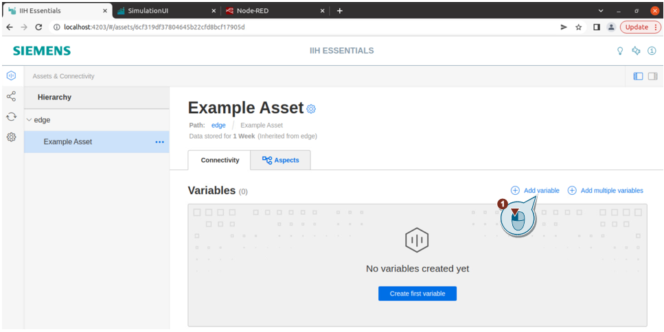

  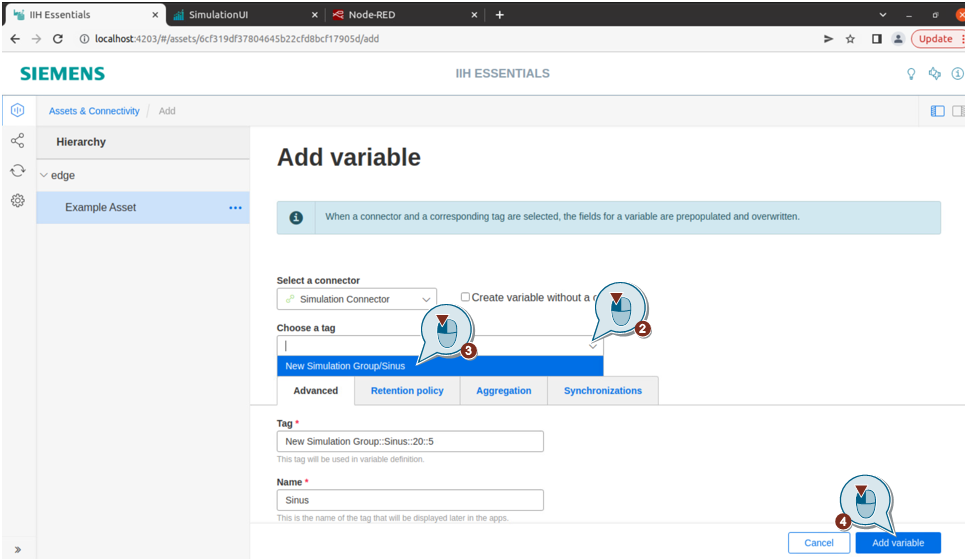

If the simulation variable has been successfully connected to the IIH Essentials, you can see the current value of the variable.

  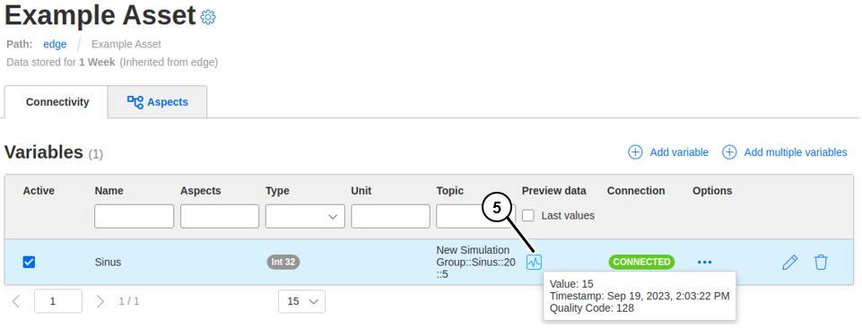

## Use provided application example to access Data via Node-RED and save data in .csv file

1. Create a folder in the same path where your docker-compose file is located and run the following command to make sure you have the right permission.
   ```bash
   mkdir export
   sudo chown -R 1000:1000 ./export
   ```
2. Open a browser.
3. Access Node-RED
   To start Node-RED, enter the following address: `http://localhost:1880`
4. Install the node-red-dashboard if it's not installed yet
   
   To install the node-red-dashboard, open "Manage palette" in the menu. In the tab "Install" search for "node-red-dashboard" and install it
    
5. If the flow is missing import the [Flow](../src/flows.json)

   To do so, open "Import" in the menu. Select the file, that should be imported, and click on "Import"
   
   The Flow contains following nodes:

   
6. Deploy the flow and access the dashboard by accessing `http://localhost:1880/ui`
7. Adjust the `From` and `To` variables based on your needs or leave it as it is for current date. 
8. Go back to your flow and double click on the `Data Service Read Variables` sub-flow. Make sure the "Variable names" match your variable inside of the Data Service. 
   
 > **_NOTE:_**  If you multiple variables, you can write them all in the "Variable names" setting sparated by commas without spaces.

9. Activate the inject buttons as described in the picture below.

   
10. Go back to the dashboard. You shoul be able to see your data visualized.

   
11. The `.csv` file is stored inside `./export` folder.