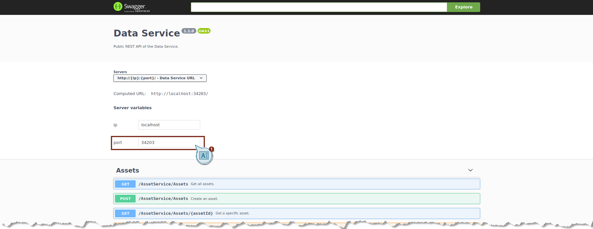
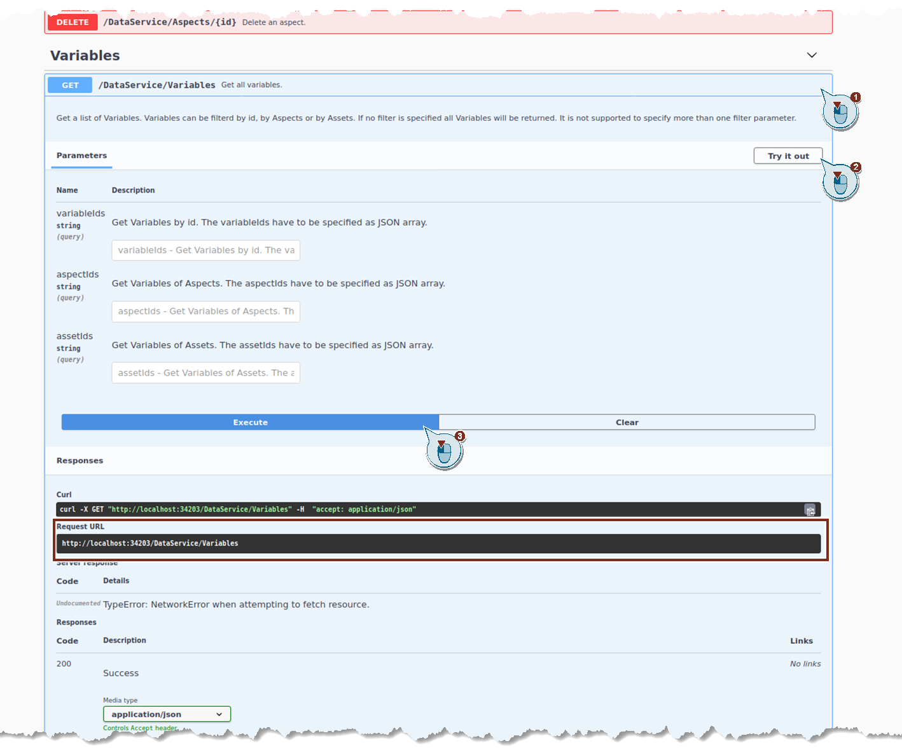
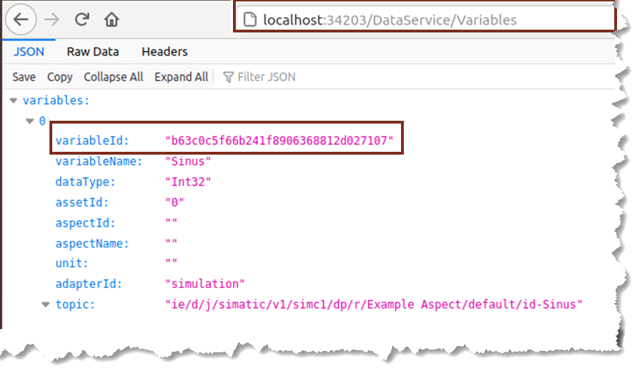
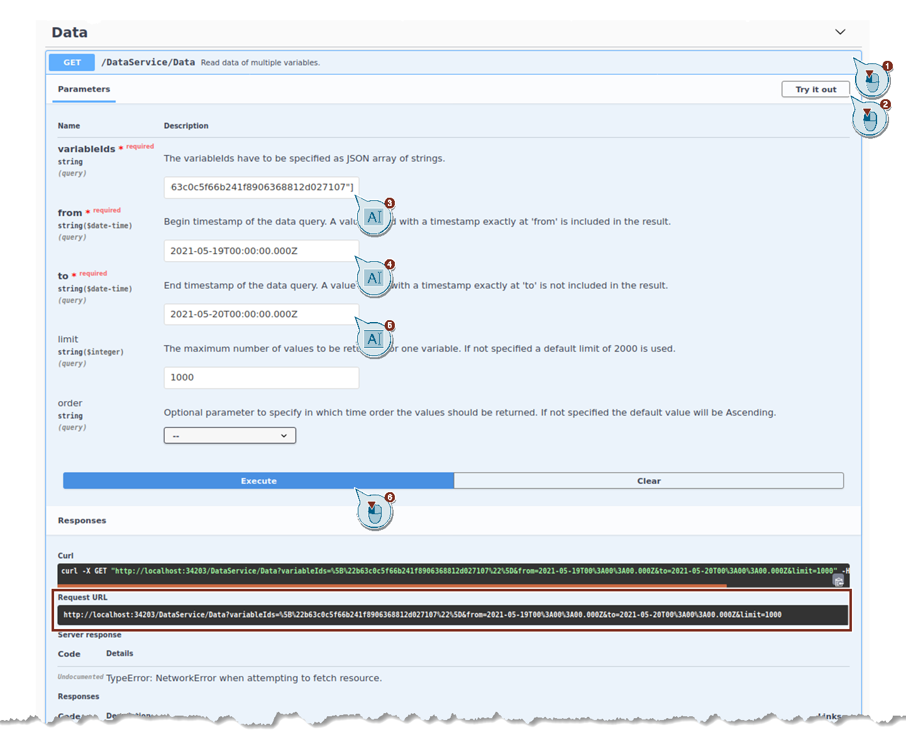
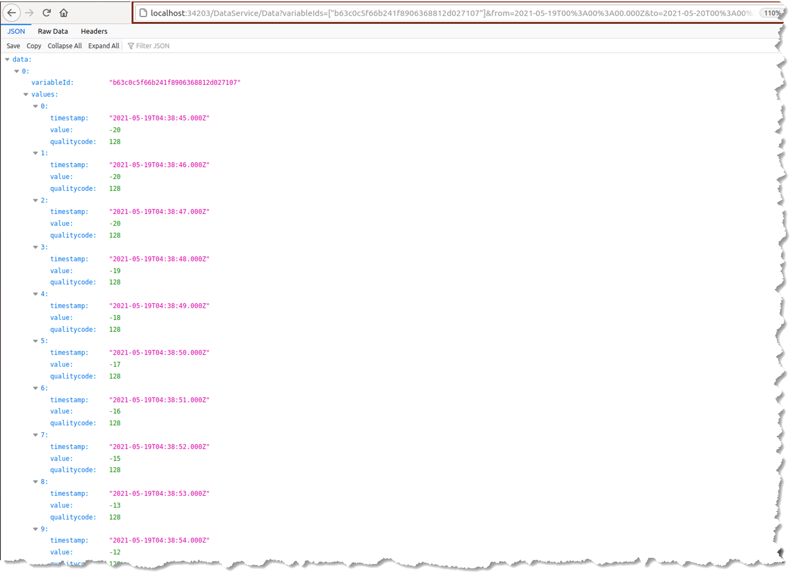
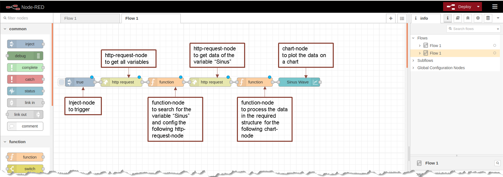
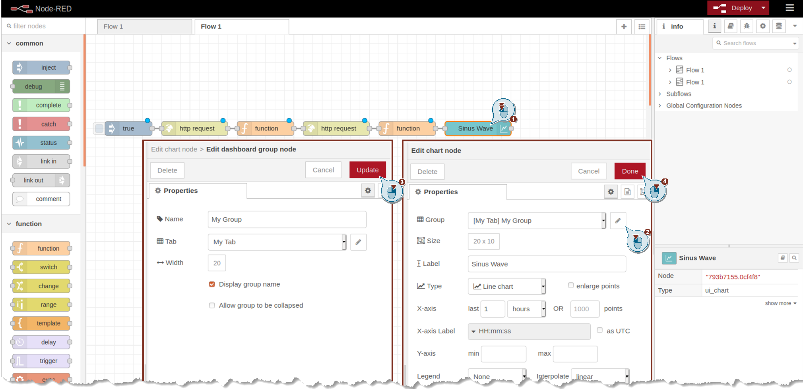
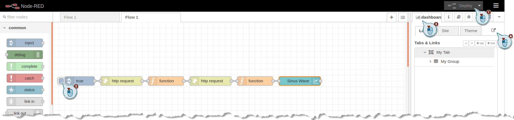
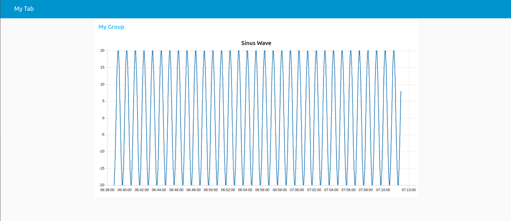

# Visualization of an example sinus in NodeRED

- [Visualization of an example sinus in NodeRED](#visualization-of-an-example-sinus-in-nodered)
  - [Description](#description)
  - [Start Docker Container](#start-docker-container)
  - [Create Tag in Simulation UI](#create-tag-in-simulation-ui)
  - [Transfer Tag to Data Service](#transfer-tag-to-data-service)
  - [Access Data via Browser](#access-data-via-browser)
  - [Access Data via Node-RED](#access-data-via-node-red)
  
## Description

This example is intended to show you how to use this application on a example sinus variable.

You will create a tag in the Simulation UI, connect the tag with the data service, display the tag via browser and finally visualize the tag via Node-RED.

You must carry out the following steps:

## Start Docker Container

To start the Docker container, follow these steps:

*Note: Linux device is used for this application example*

1. Go to your device.
2. Open the "development-kit" folder from the downloaded and extracted zip file.
   The following components are contained in it:
   - documentation
     Here you will find, for example, the user documentation and the routes (OpenAPI) for the Data Service.
   - examples
     Here you will find, for example, application examples.
   - docker-compose.yml
   - ...
3. Replace the docker-compose.yml with the [docker-compose.yml](../docker-compose.yml) of this repository.
4. Right-click in the file explorer and click on "Open in Terminal".
5. Load the Docker Image with following command: `docker load -i dataservicedevelopmentkit_1.1.0.img`
6. Start the containers by executing: `docker - compose up`
   All service images are downloaded from Docker Hub and launched as defined in the "docker-compose.yml" file. This file specifies which of the services run together, address,communication, etc.

## Create Tag in Simulation UI

To create a tag, follow these steps:

1. Open a browser.
2. Access the Simulation UI
   To start the simulation UI for the Data Service, enter the following address: `http://localhost:34519`
3. Add a Aspect with following configuration and save it
    - Name: Example Aspect
    - AssetId: 1
    - Period: 1 hour
    - Cycle: 1 second
4. Add a Variable with following configuration and save it
   - Name: Sinus
   - Datatype: int
   - Simulation:
     - Type: sinus
     - Period: 1 minute
     - Amplitude: 20

## Transfer Tag to Data Service

To connect the tag to the Data Service, follow these steps:

1. Open a browser.
2. To start the Data Service, enter the following address: `http://localhost:34203`
3. Add a Variable in tab "Connectivity"
   - Adapter: Simulation Connector
   - Tag: Example Aspect/default/Sinus

## Access Data via Browser

To access the data via browser, follow these steps:

1. Open a browser.
2. Open the routes for the Data Service: [data-service-api-specification.html](../docs/openapi-documentation/data-service-api-specification.html)
3. Change the server variable port to 34203 to get access via browser
   
4. Select the route "GET /DataService/Variables" by clicking on it
5. Click on "Try it out" to activate the settings of this route
6. Leave the Parameters empty to get all Variables
7. Click on "Execute"
8. Copy the Request URL
     
9. Paste the Request URL in a new tab of the browser
10. All configured variables are shown
11. Copy the variableId of the variable "Sinus"
   
12. Open the tab of the Data Service API Specification
13. Select the route "Get /DataService/Data
14. Click on "Try it out" to activate the settings of this route
15. Paste the variableId of the variable "Sinus" into the parameter variableIds
16. Configure the parameters "from" and "to" with a timestamp so that data should be available in between. For example you can choose from the actual day at 00:00 o´clock to next day at 00:00 o´clock
17. Click on "Execute"
18. Copy the Request URL
    
19. Paste the Request URL in a new tab of the browser
20. All values of variable "Sinus" are shown
    

## Access Data via Node-RED

1. Open a browser.
2. Access Node-RED
   To start Node-RED, enter the following address: `http://localhost:1880`
3. Install the node-red-dashboard
   To install the node-red-dashboard, open "Manage palette" in the menu. In the tab "Install" search for "node-red-dashboard" and install it
    
4. Import the [Flow](../src/NodeRED/flows.json)
   To import the flow, open "Import" in the menu. Select the file, that should be imported, and click on "Import"
   
   The Flow contains following nodes:
   
5. Select a Group for the chart-node "Sinus Wave"
   To edit the Group of the Sinus Wave, double click on node "Sinus Wave". "Edit" the Group and "Update" it
   
6. Deploy th Flow
7. Inject by clicking on the node "true"
8. Open Dashboard to see the values of "Sinus"
   To open the Dashboard, select tab "dashboard" in the top right of Node-RED and expand it
   
9. A new Tab with the chart opens
    
